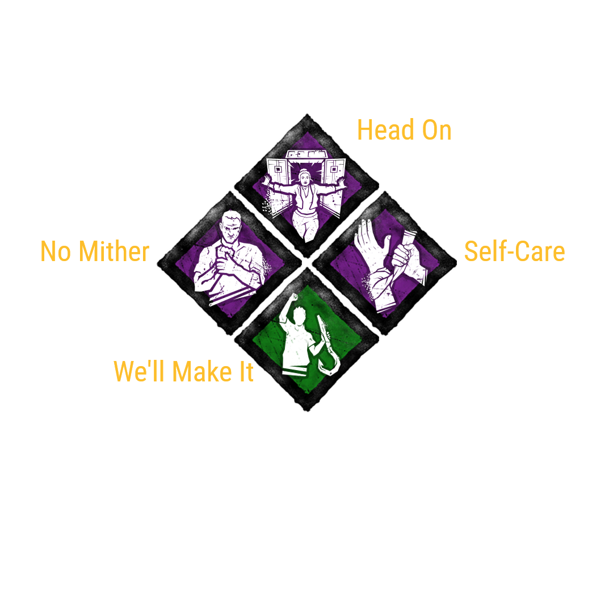

# render-dead-by-daylight-build


<a href="https://raw.githubusercontent.com/jaid/render-dead-by-daylight-build/master/license.txt"></a> <a href="https://github.com/sponsors/jaid"></a>  
<a href="https://actions-badge.atrox.dev/jaid/render-dead-by-daylight-build/goto"></a> <a href="https://github.com/jaid/render-dead-by-daylight-build/commits"></a> <a href="https://github.com/jaid/render-dead-by-daylight-build/commits"></a> <a href="https://github.com/jaid/render-dead-by-daylight-build/issues"></a>  
<a href="https://npmjs.com/package/render-dead-by-daylight-build"></a> <a href="https://github.com/jaid/render-dead-by-daylight-build/network/dependents"></a> <a href="https://npmjs.com/package/render-dead-by-daylight-build"></a>

**Creates an image of a Dead by Daylight build.**


## Installation

<a href="https://npmjs.com/package/render-dead-by-daylight-build"></a>

```bash
npm install --save render-dead-by-daylight-build@^1.1.0
```

<a href="https://yarnpkg.com/package/render-dead-by-daylight-build"></a>

```bash
yarn add render-dead-by-daylight-build@^1.1.0
```

<a href="https://github.com/jaid/render-dead-by-daylight-build/packages"></a>  
(if [configured properly](https://help.github.com/en/github/managing-packages-with-github-packages/configuring-npm-for-use-with-github-packages))

```bash
npm install --save @jaid/render-dead-by-daylight-build@^1.1.0
```


## Example



This image is rendered by this code:
```javascript
import renderDeadByDaylightBuild from "render-dead-by-daylight-build"
import Jimp from "jimp"

const perkIds = ["wellMakeIt", "noMither", "selfCare", "headOn"]
const screenshotBuffer = await renderDeadByDaylightBuild(perkIds)

const jimp = await Jimp.read(screenshotBuffer)
await jimp.writeAsync("./build.png")
```


## Development


Setting up:
```bash
git clone git@github.com:jaid/render-dead-by-daylight-build.git
cd render-dead-by-daylight-build
npm install
```
Testing:
```bash
npm run test:dev
```
Testing in production environment:
```bash
npm run test
```


## License
[MIT License](https://raw.githubusercontent.com/jaid/render-dead-by-daylight-build/master/license.txt)  
Copyright © 2020, Jaid \<jaid.jsx@gmail.com> (https://github.com/jaid)
